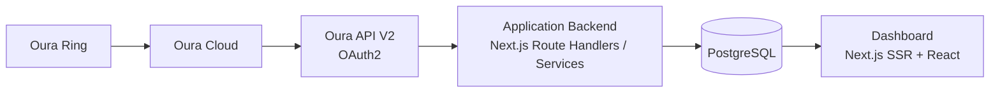
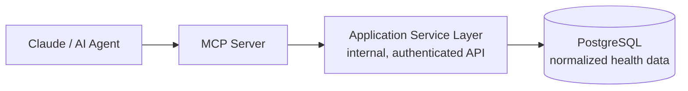
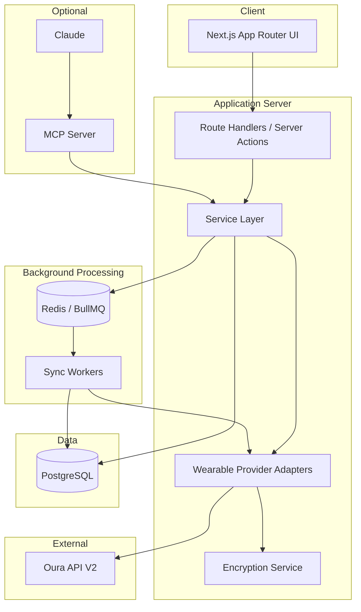
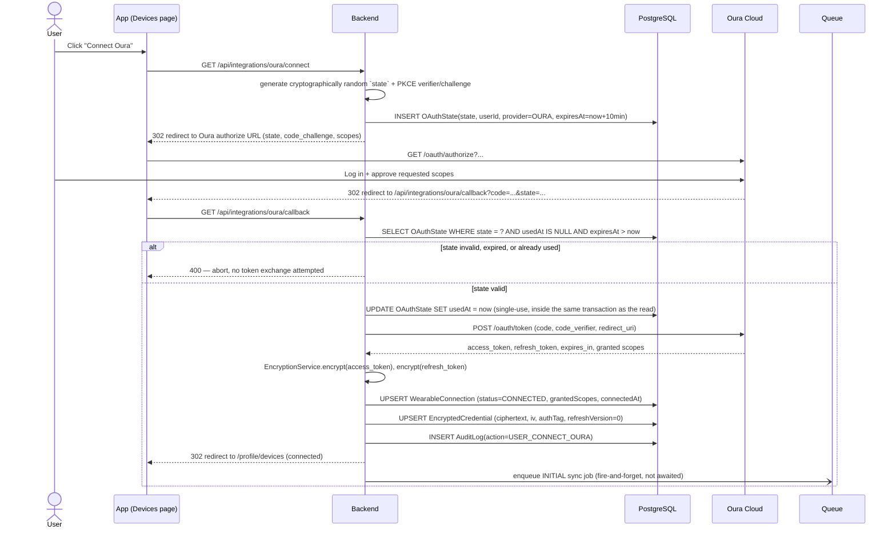
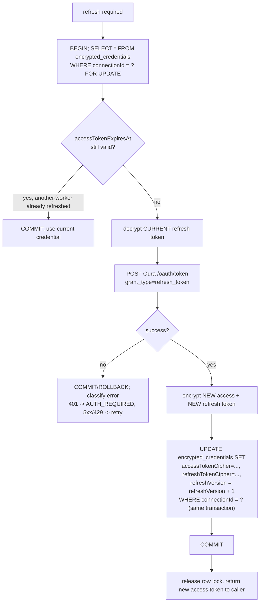
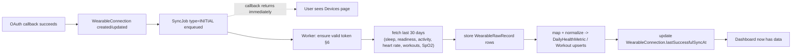
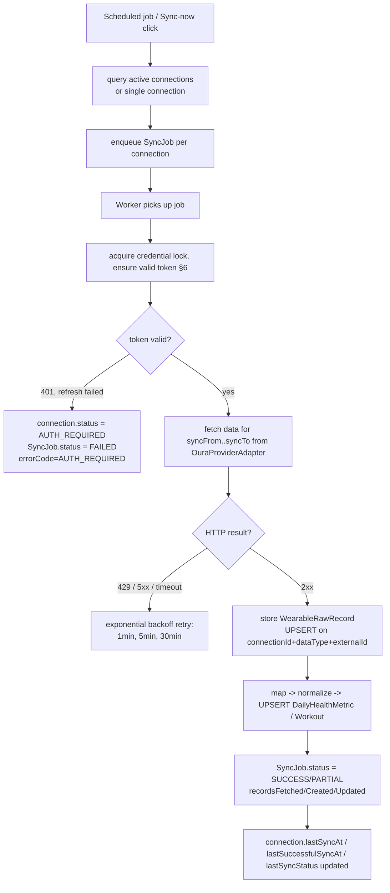
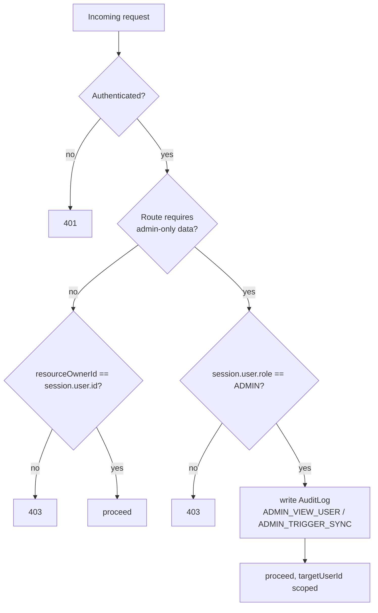
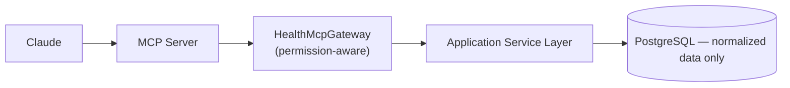

# Longevity App — Architecture

Oura Ring–first health & wellness platform, built so that Garmin, WHOOP, Fitbit,
Apple Health, Samsung Health, Withings, smart scales and CGMs can be added later
without touching the core. This document is the output of the pre-implementation
architecture pass — no application code exists yet. Phase 1 (Next.js/Prisma/Auth
foundation) starts only after this document is reviewed and accepted.

**Non-negotiable rule, repeated everywhere in this doc:** the Oura Ring
integration is a REST/OAuth2 client living in the backend. MCP is a separate,
optional, read-only AI-integration layer. The platform must be 100% functional
if the MCP server is down, removed, or never started.

---

## Table of contents

1. [System architecture](#1-system-architecture)
2. [Repository structure](#2-repository-structure)
3. [Database — Prisma schema](#3-database--prisma-schema)
4. [Authentication architecture](#4-authentication-architecture)
5. [Oura OAuth2 sequence](#5-oura-oauth2-sequence)
6. [Rotating refresh token handling](#6-rotating-refresh-token-handling)
7. [Oura data synchronization flow](#7-oura-data-synchronization-flow)
8. [Admin authorization model](#8-admin-authorization-model)
9. [MCP future architecture](#9-mcp-future-architecture)
10. [Security threat summary](#10-security-threat-summary)
11. [Environment variables](#11-environment-variables)
12. [Phased delivery plan](#12-phased-delivery-plan)
13. [MVP acceptance criteria](#13-mvp-acceptance-criteria)

---

## 1. System architecture

### 1.1 Core data path (always on, no MCP dependency)



The dashboard **never** calls the Oura API directly and **never** calls MCP.
It reads exclusively from `DailyHealthMetric` / `Workout` in PostgreSQL, which
are populated by the background sync worker. This is what makes the platform
independent of both Oura's uptime and MCP's uptime at request time.

### 1.2 Optional AI/integration layer (isolated)



MCP talks to the **application's own internal API**, never to Oura, and never
holds an OAuth credential. If the MCP server process is killed, sync jobs keep
running, the dashboard keeps rendering, and no user-facing feature degrades.

### 1.3 Component map



### 1.4 Why this shape

- **Replaceability**: `WearableProviderAdapter` is the only thing that knows
  about Oura's JSON shapes and OAuth quirks. Adding Garmin means adding
  `GarminProviderAdapter`, not touching the dashboard, the DB schema (beyond
  the generic `WearableProvider` enum), or the sync orchestration.
- **Failure isolation**: Oura being down, rate-limited, or revoked affects
  only that user's `WearableConnection`; it cannot take down auth, dashboard,
  or other users' syncs (see §7.4).
- **No implicit trust for AI**: MCP is a client of the same authorization
  rules as everything else — it cannot bypass `requireOwnResourceOrAdmin`,
  and it never sees a credential (see §9).
- **Modular monolith, not premature microservices**: one deployable Next.js
  app + one worker process, sharing the Prisma client and service layer. The
  service layer is written so it *could* later be lifted into a standalone
  NestJS backend (plain classes/functions, no React imports, no framework
  coupling in `services/*` or `modules/*/domain`).

---

## 2. Repository structure

```text
longevity-app/
├── ARCHITECTURE.md
├── docker-compose.yml
├── .env.example
├── prisma/
│   ├── schema.prisma
│   └── seed.ts
├── src/
│   ├── app/                          # Next.js App Router (routes only — no business logic)
│   │   ├── (auth)/
│   │   │   ├── login/
│   │   │   ├── register/
│   │   │   └── reset-password/
│   │   ├── (onboarding)/onboarding/
│   │   ├── dashboard/
│   │   ├── trends/
│   │   ├── profile/
│   │   │   ├── lifestyle/
│   │   │   ├── nutrition/
│   │   │   ├── supplements/
│   │   │   ├── goals/
│   │   │   └── devices/
│   │   ├── admin/
│   │   │   └── users/[id]/
│   │   └── api/
│   │       ├── auth/[...nextauth]/
│   │       ├── profile/
│   │       ├── supplements/
│   │       ├── goals/
│   │       ├── wearables/
│   │       ├── integrations/oura/{connect,callback,disconnect,sync}/
│   │       ├── dashboard/{,trends}/
│   │       └── admin/users/[id]/{,dashboard,sync}/
│   │
│   ├── components/                   # Presentational + shadcn/ui-based components only
│   │
│   ├── modules/                      # Domain modules — the real business logic
│   │   ├── auth/
│   │   ├── profile/
│   │   ├── nutrition/
│   │   ├── exercise/
│   │   ├── supplements/
│   │   ├── goals/
│   │   ├── wearable/
│   │   │   ├── domain/                # types, pure logic, no I/O
│   │   │   ├── services/              # wearable.service.ts, sync.service.ts
│   │   │   └── providers/
│   │   │       └── oura/
│   │   │           ├── oura-client.ts
│   │   │           ├── oura-auth.ts
│   │   │           ├── oura-provider.ts
│   │   │           ├── oura-mappers.ts
│   │   │           └── oura-types.ts
│   │   ├── dashboard/
│   │   └── admin/
│   │
│   ├── lib/
│   │   ├── auth/                     # requireAuthenticatedUser, requireAdmin, requireOwnResourceOrAdmin
│   │   ├── db/                       # Prisma client singleton
│   │   ├── encryption/                # EncryptionService (AES-256-GCM, KMS-ready)
│   │   ├── logging/                   # structured logger, redaction rules
│   │   └── validation/                # shared Zod schemas
│   │
│   ├── jobs/
│   │   ├── wearable-sync.job.ts
│   │   ├── oura-initial-sync.job.ts
│   │   ├── oura-daily-sync.job.ts
│   │   └── oura-manual-sync.job.ts
│   │
│   └── mcp/
│       ├── gateway.ts                 # HealthMcpGateway interface + implementation
│       └── tools/                     # get_user_daily_health, get_user_sleep_trend, ...
│
├── tests/
│   ├── unit/
│   ├── integration/
│   └── e2e/                          # Playwright
│
└── docs/
    └── oura-production-approval.md
```

Rules enforced by this layout (see §12 implementation rules for the full list):

- `app/**` contains routing, request parsing, calling a service, and
  formatting a response — nothing else. No business logic in Route Handlers,
  no direct Oura calls from UI code.
- `modules/**/domain` has zero I/O and zero framework imports — this is what
  makes a future NestJS split mechanical instead of a rewrite.
- Only `modules/wearable/providers/oura/*` knows Oura's JSON shapes. Nothing
  outside that folder imports an Oura type.
- `mcp/**` depends on `modules/**/services` (the application's own internal
  API surface), never on `providers/oura/*` and never on `lib/encryption`.

---

## 3. Database — Prisma schema

Full schema proposal: [`prisma/schema.prisma`](./prisma/schema.prisma) (delivered
alongside this document). Highlights and the reasoning behind the less obvious
choices:

| Model | Purpose | Key constraint |
|---|---|---|
| `User` | identity, role, status, consent timestamps | `email` unique |
| `Profile`, `ExerciseProfile`, `NutritionProfile` | onboarding data, 1:1 with `User` | `userId` unique |
| `Supplement`, `Goal` | unbounded user-owned lists | indexed on `userId` |
| `WearableConnection` | one row per (user, provider) connection attempt | **not** unique on `(userId, provider)` — a user may reconnect after a full revoke, and later run two connections of different providers; uniqueness is enforced at the "one CONNECTED row per provider" level in the service layer, not the DB, so history is preserved |
| `EncryptedCredential` | OAuth tokens, ciphertext only | 1:1 with `WearableConnection`; never selected by any query outside `modules/wearable/*` |
| `WearableRawRecord` | raw provider JSON, replayable | `@@unique([connectionId, dataType, externalId])` is the idempotency key that makes every sync safely re-runnable |
| `DailyHealthMetric` | normalized, dashboard-facing | `@@unique([userId, date])` — sync always **upserts** this row |
| `Workout` | normalized workouts | `@@unique([provider, externalId])` |
| `SyncJob` | observability + retry bookkeeping | indexed on `status`, `createdAt` for the admin dashboard KPIs |
| `OAuthState` | CSRF state for the OAuth handshake | unique `state`, `expiresAt`, `usedAt` — see §5 |
| `EncryptedCredential.refreshVersion` / `refreshLockedAt` / `refreshLockedBy` | concurrency control for token refresh | see §6 |
| `AuditLog` | admin/security trail | `metadata` is JSONB but is validated at the service layer to never contain a token, password, or raw health payload |
| `Account` / `Session` / `VerificationToken` | Auth.js tables | present from day one so enabling Google login later is a config change, not a migration |

`DailyHealthMetric.sourceProviders` is included now (even though MVP has one
provider) specifically so that a future Garmin+Oura user doesn't require a
schema migration to represent "this day's steps came from Garmin, this day's
sleep came from Oura."

---

## 4. Authentication architecture

**Library:** Auth.js (NextAuth v5), Credentials provider for email+password,
JWT session strategy (stateless, works well with Route Handlers and
middleware). `Account`/`Session`/`VerificationToken` tables are provisioned
now so a Google OAuth provider can be added later purely as configuration.

### 4.1 Password handling

- Hashing: **Argon2id** (`argon2` package, tuned memory/time cost for the
  deployment target — documented in `lib/auth/password.ts`).
- Policy enforced both client-side (UX) and server-side (source of truth) via
  a shared Zod schema: minimum 10 characters, at least one lowercase, one
  uppercase, one digit.

### 4.2 Central authorization helpers (`src/lib/auth/authorization.ts`)

```ts
// Throws 401 if there is no valid session.
async function requireAuthenticatedUser(): Promise<SessionUser>

// Throws 403 if the caller's role is not ADMIN.
async function requireAdmin(): Promise<SessionUser>

// Throws 403 unless caller.id === resourceOwnerId OR caller.role === ADMIN.
async function requireOwnResourceOrAdmin(
  resourceOwnerId: string,
): Promise<SessionUser>
```

Every Route Handler and Server Action calls one of these **first**, before
touching Prisma. The frontend hiding an "Admin" link is a UX nicety, never a
security boundary — this is enforced by the IDOR/BOLA tests in §10.6 that
call the API directly, bypassing the UI entirely.

### 4.3 Session security

- Cookies: `HttpOnly`, `Secure` in production, `SameSite=Lax` (default) /
  `Strict` where it doesn't break the OAuth callback redirect flow.
- Session rotation on login (new JWT, new `jti`), and on privilege-relevant
  events (password change, password reset).
- Rate limiting on `/login`, `/register`, `/password-reset`,
  `/api/integrations/oura/connect`, `/api/integrations/oura/sync` — see §10.

### 4.4 Registration & verification

Registration collects full name, email, password + confirmation, and
explicit Terms/Privacy checkboxes; `termsAcceptedAt` / `privacyAcceptedAt`
are stamped server-side at the moment of acceptance, not inferred later.
Email verification is mandatory before onboarding starts — enforced by a
route guard in `(onboarding)` and `(dashboard)` layouts, not just by hiding a
link.

### 4.5 Password reset

Reset tokens are cryptographically random, single-use (`usedAt`), short-lived
(`expiresAt`), and stored **hashed** (`PasswordResetToken.tokenHash`) — the
raw token exists only in the emailed link. The response to "does this email
exist" is identical whether or not the account exists, to prevent user
enumeration.

---

## 5. Oura OAuth2 sequence

Authorization Code flow with PKCE, **one connection per user**, state bound
to the user's session and single-use.



Key decisions:

- **Requested scopes (MVP):** `personal daily heartrate workout spo2Daily`.
  `email` is intentionally **not** requested — the platform already has the
  user's email from registration. `tag`/`session` are deferred.
- **Scopes actually granted** (the user can decline some in Oura's consent
  screen) are stored verbatim in `WearableConnection.grantedScopes` and
  re-checked before any adapter call that needs a scope the user didn't grant.
- The callback **does not** wait for the historical import; it enqueues the
  `INITIAL` sync job and redirects immediately (§7.1).
- `OAuthState` rows expire in ~10 minutes and are cleaned up by a scheduled
  job; a stale or reused `state` is rejected outright (this is also the
  CSRF defense for the callback endpoint).

---

## 6. Rotating refresh token handling

Oura issues **rotating, single-use refresh tokens**: every refresh call
invalidates the previous refresh token and returns a new one. If two workers
refresh concurrently, the loser's refresh token is already dead by the time it
tries to use it — this must never happen for the *same* connection.

### 6.1 Design

`EncryptedCredential` carries an optimistic-concurrency version
(`refreshVersion`) plus a short-lived advisory lock (`refreshLockedAt`,
`refreshLockedBy`), backed by a Postgres `SELECT ... FOR UPDATE` transaction
(a distributed Redis lock is an acceptable alternative if the worker fleet
needs it — the interface is the same either way):

```ts
interface CredentialLock {
  acquire(connectionId: string, holder: string): Promise<LockHandle | null>
  release(handle: LockHandle): Promise<void>
}
```

### 6.2 Flow



Guarantees this gives us:

1. **Only one worker reaches the Oura token endpoint** for a given
   connection at a time — the `SELECT ... FOR UPDATE` serializes concurrent
   refreshers on that row; everyone else blocks until the transaction commits.
2. **The second worker never uses a dead refresh token.** After acquiring the
   lock, it re-checks `accessTokenExpiresAt`/`refreshVersion`; if another
   worker already refreshed inside the wait, it simply reads the fresh
   credential instead of calling Oura again.
3. **New access + new refresh token are persisted atomically**, in the same
   transaction, so a crash between "got tokens from Oura" and "saved them" is
   the only failure window — and that window calls for the credential to be
   treated as `AUTH_REQUIRED` and the user asked to reconnect, rather than
   silently retried with a token we no longer have (retrying with a token we
   never persisted would itself violate single-use).
4. **`EncryptedCredential` is the source of truth** — no token is ever cached
   in the job payload, in Redis, or in application memory beyond the single
   request that needed it.

This exact scenario — two workers racing to refresh the same connection — is
a mandatory concurrency test, not just documentation (§10.7).

---

## 7. Oura data synchronization flow

### 7.1 Initial sync (on first connect)



### 7.2 Daily automatic sync

A scheduler (BullMQ repeatable job, or Trigger.dev/Inngest cron) runs at
least once a day: query all `WearableConnection` rows with
`status = CONNECTED`, enqueue one `DAILY` `SyncJob` per connection. **A
browser request never triggers this** — it is purely server-scheduled.

### 7.3 Incremental sync window

```text
syncFrom = lastSuccessfulSyncAt.dataDate - 2 days   // safety overlap
syncTo   = today
```

The 2-day overlap exists because Oura's own daily scores can be revised after
the fact (e.g. readiness recalculated once more HR data lands) — re-fetching
those two days and **upserting** is deliberate, not a bug.

### 7.4 Full sync flow (daily & manual)



One user's failure (expired credential, malformed payload, Oura outage) never
blocks another user's job — each `SyncJob` is an independent queue item;
workers are horizontally scalable and stateless between jobs.

### 7.5 Manual sync

`POST /api/integrations/oura/sync` only **enqueues** a `MANUAL` `SyncJob` and
returns immediately (202-style response) — it never blocks on the Oura
round-trip. Rate-limited to 1 manual sync per user per 5 minutes, enforced
server-side (not just a disabled button).

### 7.6 Idempotency

- `WearableRawRecord`: unique on `(connectionId, dataType, externalId)`.
- `DailyHealthMetric`: unique on `(userId, date)`, always upserted.
- `Workout`: unique on `(provider, externalId)`.

Any retry, at any layer, produces the same end state — never duplicate rows.

---

## 8. Admin authorization model

### 8.1 Principle

`UserRole.ADMIN` is a **server-side** claim checked on every request that
touches another user's data. There is no separate "admin API base URL" that
is somehow more trusted — `requireAdmin()` / `requireOwnResourceOrAdmin()`
(§4.2) gate the exact same Prisma queries that a regular user's own request
would use.



### 8.2 Admin capabilities (all audited)

| Action | Endpoint | Audit action |
|---|---|---|
| List all users, search, filter by Oura status | `GET /api/admin/users` | — (read, not individually audited) |
| Open a user's full dashboard | `GET /api/admin/users/:id/dashboard` | `ADMIN_VIEW_USER` |
| Trigger a manual sync for a user | `POST /api/admin/users/:id/sync` | `ADMIN_TRIGGER_SYNC` |

The admin user-detail page (`/admin/users/:id`) renders a persistent
`ADMIN VIEW — Viewing user: {name}` banner — a UX safeguard against an admin
forgetting which context they're in, in addition to (not instead of) the
server-side scoping.

### 8.3 What admins cannot do

Admins do not gain implicit access to OAuth credentials — `EncryptedCredential`
is never returned by any admin endpoint, decrypted or not. Admin can see
*connection status* (`CONNECTED`/`AUTH_REQUIRED`/`ERROR`, last sync time) and
*trigger* a sync, never read or export a token.

---

## 9. MCP future architecture



```ts
interface HealthMcpGateway {
  getHealthSummary(ctx: McpAuthContext): Promise<HealthSummary>
  getSleepContext(ctx: McpAuthContext, range: DateRange): Promise<SleepContext>
  getRecoveryContext(ctx: McpAuthContext, range: DateRange): Promise<RecoveryContext>
  getActivityContext(ctx: McpAuthContext, range: DateRange): Promise<ActivityContext>
}

// McpAuthContext carries a resolved, already-authorized userId — it is
// derived the same way a Route Handler resolves session.user.id, never
// accepted as a bare, caller-supplied parameter.
```

Rules that make this safe, all enforced in code review / lint, not just docs:

- `src/mcp/**` may import from `modules/**/services` only. A lint rule
  (dependency-cruiser or similar) forbids `mcp/**` importing anything under
  `modules/wearable/providers/**` or `lib/encryption/**`.
- MCP tools (`get_user_daily_health`, `get_user_sleep_trend`,
  `get_user_readiness_trend`, `get_user_activity_trend`,
  `get_user_health_summary`) never accept an arbitrary `userId` argument from
  the model — the tool call is bound to an already-authenticated context
  (the same session/token machinery as the web app), exactly like
  `requireOwnResourceOrAdmin`.
- MCP never receives an OAuth token, encrypted or not, and never calls the
  `OuraProviderAdapter` directly.
- `mitchhankins01/oura-ring-mcp` is a useful *reference* for what an
  Oura-shaped MCP tool surface can look like, but it is not forked wholesale;
  our MCP talks to our own normalized API, not to Oura.
- Conversational flow (future): `User → Platform UI → Claude → MCP tools →
  Platform normalized DB`. `Claude → raw OAuth token → Oura` is an
  architecture that must never exist.
- The `InsightEngine` placeholder (`generateDailyInsights`,
  `generateTrendInsights`) is scaffolded as an interface only in the MVP —
  no diagnostic AI output ships until a dedicated design pass happens for it,
  and even then it stays comparative/observational ("HRV is below your
  30-day baseline"), never diagnostic.

The MVP ships `HealthMcpGateway` as an interface plus a minimal in-process
implementation for local testing; wiring an actual MCP server process is
Phase 10, deliberately last.

---

## 10. Security threat summary

| # | Threat | Vector | Mitigation |
|---|---|---|---|
| 1 | IDOR / BOLA | `GET /api/dashboard?userId=<other>`, `GET /api/admin/users/:id` as a non-admin | `requireOwnResourceOrAdmin` / `requireAdmin` on every handler touching user-scoped data; explicit test suite (§10.6) |
| 2 | Refresh-token race condition | Two workers refresh the same connection concurrently | Row-level lock + atomic persist, §6; dedicated concurrency test (§10.7) |
| 3 | OAuth token leakage | Token in a log line, Sentry breadcrumb, analytics event, browser storage, AI prompt | Tokens only ever exist encrypted in `EncryptedCredential`; structured logger has a redaction allowlist, never an denylist; MCP never receives a token (§9) |
| 4 | CSRF on OAuth callback | Attacker crafts a callback URL with their own `code` | Cryptographically random, session-bound, single-use, short-TTL `state` (§5) |
| 5 | Session hijacking / fixation | Stolen cookie, session reuse after login | `HttpOnly`/`Secure`/`SameSite` cookies, session rotation on login, short JWT lifetime |
| 6 | Brute force / credential stuffing | Repeated `/login`, `/register`, `/password-reset` attempts | Rate limiting by IP + identifier (5 attempts / 15 min) on all auth and OAuth-connect endpoints |
| 7 | User enumeration | Different response for "email exists" vs "doesn't" on login/reset | Identical response shape/timing regardless of account existence |
| 8 | Duplicate/replayed sync data | Retried job, redelivered queue message | Unique constraints + UPSERT everywhere in the sync path (§7.6) |
| 9 | Malicious/oversized input | Profile, supplement, goal forms | Zod validation server-side on every endpoint, independent of client validation |
| 10 | Health data exposure at rest | DB compromise, backup leak, misconfigured logging | TLS in transit, encryption at rest for the DB volume, `EncryptedCredential` additionally application-layer encrypted (AES-256-GCM), raw payloads never sent to Sentry/analytics/dev DB |
| 11 | Privilege escalation via client | Client sends `role: "ADMIN"` in a profile update payload | Role is never client-writable; only set via server-side admin tooling, validated against the authenticated session, not request body |
| 12 | Scope over-grant | Requesting more Oura scopes than needed | Minimal scope set requested (§5); actually-granted scopes stored and checked before use |
| 13 | Stale/leaked OAuth state | `OAuthState` reused or left valid indefinitely | Single-use (`usedAt`), short expiry, cleanup job |
| 14 | GDPR — right to erasure not honored | Account deletion doesn't remove wearable data/credentials | Deletion flow explicitly: revoke Oura authorization → delete `EncryptedCredential` → delete/anonymize raw + normalized health data per retention policy (§13, item 50) |
| 15 | Audit trail tampering/incompleteness | Admin action not logged, or log contains sensitive payload | Every admin data-access/mutation writes `AuditLog`; explicit denylist of fields that must never appear in `metadata` (tokens, passwords, raw payloads) |

### 10.6 Mandatory IDOR/BOLA tests

```text
As User A:
  GET /api/admin/users/{UserB.id}              -> 403
  GET /api/dashboard?userId={UserB.id}          -> ignored/403 (own id is derived from session, not the query param)
As Admin:
  GET /api/admin/users/{UserB.id}               -> 200, and an ADMIN_VIEW_USER AuditLog row is created
```

### 10.7 Mandatory refresh-token race test

Two simulated workers call the refresh path for the same `WearableConnection`
at the same time. Expected: exactly one request reaches Oura's token
endpoint; the second worker observes the already-refreshed credential and
uses it; `EncryptedCredential.refreshVersion` increments exactly once; no
`AUTH_REQUIRED` state is incorrectly produced by the "loser."

---

## 11. Environment variables

See [`.env.example`](./.env.example) (delivered alongside this document) for
the full list — `DATABASE_URL`, `AUTH_SECRET`, `APP_URL`, `OURA_CLIENT_ID`,
`OURA_CLIENT_SECRET`, `OURA_REDIRECT_URI`, `TOKEN_ENCRYPTION_KEY`,
`REDIS_URL`, `OURA_MOCK_MODE`, `SENTRY_DSN`. No secret is ever committed;
`OURA_MOCK_MODE=true` generates ≥30 days of mock sleep/readiness/activity/HRV/
resting-HR/steps/calories/workout data so the platform is developable without
a real Oura account or production API approval.

---

## 12. Phased delivery plan

| Phase | Scope |
|---|---|
| 0 | **This document** — architecture, schema proposal, no app code |
| 1 | Foundation: Next.js, TypeScript strict, Prisma, PostgreSQL, Auth.js, base UI shell |
| 2 | Profiles: onboarding wizard, exercise, nutrition, supplements, goals |
| 3 | Wearable domain: `WearableConnection`, provider interfaces, encrypted credential storage |
| 4 | Oura OAuth: authorize, callback, credential storage, rotating-refresh handling, revoke |
| 5 | Oura ingestion: API client, raw storage, mappers, normalization |
| 6 | Dashboard: today view + 7/30-day trends |
| 7 | Background sync: queue, scheduler, retries, incremental sync |
| 8 | Admin: users list, search/filters, user detail, manual sync |
| 9 | Security hardening: rate limiting, IDOR tests, refresh-race test, audit log completeness |
| 10 | MCP / AI-ready layer — only after Phase 1–9 work with MCP absent |

Each phase ends with: TypeScript compile clean, lint clean, unit + integration
tests passing, a short security sanity check, and a brief note of what was
implemented, what was tested, known limitations, and what's next. No phase
starts before the previous one is green.

---

## 13. MVP acceptance criteria

Authentication: registration, verification, login, logout, password reset.
Profile: personal profile, nutrition, exercise, supplements, goals.
Oura: OAuth connect, secure state, token exchange, encrypted credentials,
rotating refresh token, concurrent-refresh protection, 30-day initial import,
daily sync, manual sync, disconnect/revoke.
Dashboard: Sleep/Readiness/Activity scores, HRV, resting HR, sleep duration,
steps, 7-day and 30-day charts.
Admin: users list, search, filters, user dashboard, sync state, manual
admin-triggered sync.
Security: server-side authorization everywhere, IDOR protection, encrypted
credentials, audit trail, input validation, rate limits.
Architecture: core system works with MCP absent; MCP isolated from OAuth
credentials; Oura provider is replaceable; additional wearables can be added
without a rewrite.

GDPR/consent: Terms + Privacy consent captured with timestamps; account
deletion revokes the Oura authorization, deletes encrypted credentials, and
deletes/anonymizes wearable raw + normalized health data per retention
policy. Medical disclaimer ("this platform provides wellness information and
does not provide medical diagnoses or medical advice") is shown in the UI.

---

*Next step: review this document and `prisma/schema.prisma`. Once accepted,
Phase 1 (Next.js + TypeScript + Prisma + PostgreSQL + Auth.js foundation)
begins.*
